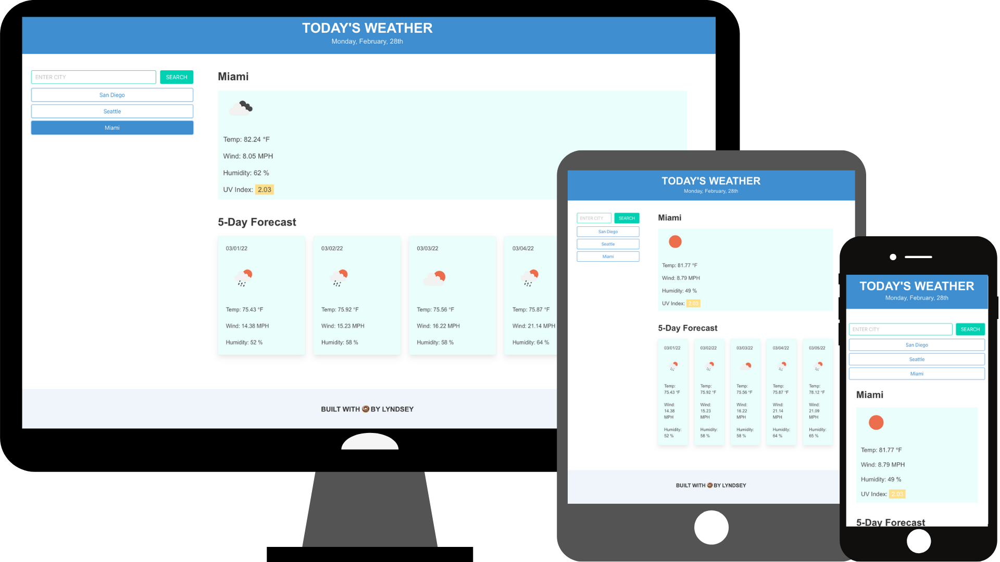

# Weather Dashboard Assignment 

## Purpose 
Build a weather dashboard that runs in the browser and features dynamically updated HTML and CSS. This app will use the OpenWeather One Call API to retrieve weather data for cities and will leverage localStorage to store any persistent data.

## Technologies
* HTML 
* CSS
* Bulma
* JavaScript
* Moment.js

## APIs
* OpenWeather Geocoding API
* OpenWeather One Call API

## URLs
* Repo: https://github.com/lyndsclev/weather-dashboard
* App: https://lyndsclev.github.io/weather-dashboard/

## Images/Demo
